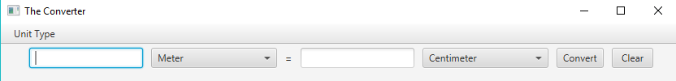
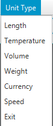

# The Unit Converter
The application of converting the value of unit as *Length, Currency, Speed, Temperature,
Volume, Weight*. Using JavaFx for design
the application. 

**Lab7-LengthConverter,** **PA3-Unit Converter** *Computer programing II* assignment

The instructions of this class are [Lab7-LengthConverter.pdf](https://skeoop.github.io/week7/Lab7-LengthConverter.pdf), 
[PA3-Unit Converter](https://skeoop.github.io/week8/PA3-UnitConverter.pdf)

Run the application **Download:** [converterfx-darmonlyone.jar](Converter_darm_jar/converterfx-darmonlyone.jar) 

